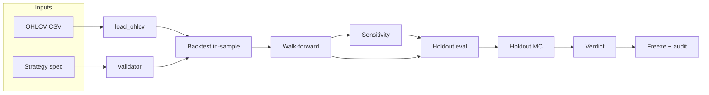

# Topstep pipeline

Python toolkit to **backtest MNQ strategies**, run **walk-forward** selection, stress **parameters**, evaluate a **holdout** window, run two kinds of **Monte Carlo**, and emit a **verdict** with optional **frozen parameters** and **audit** artifacts.

## Quick start

```bash
python -m venv .venv
# Windows: .venv\Scripts\activate
# Unix:    source .venv/bin/activate

pip install -e .
python -m v3.cli --list-strategies
python -m v3.cli --strategy connors_rsi2 --timeframe 5min
```

Console entry point (after install): `topstep-pipeline` (same flags as `python -m v3.cli`).

### Data

Place OHLCV CSVs under `Data/` (or point env at your folder):

- `mnq_1min_databento.csv`, `mnq_5min_databento.csv`, `mnq_15min_databento.csv`  
- Expected columns include OHLCV + a datetime index/column (see `data.py`).

Environment overrides:

| Variable | Purpose |
| -------- | ------- |
| `TOPSTEP_PIPELINE_DATA_DIR` | Directory containing MNQ CSV bundles (default: `<repo>/Data`) |
| `TOPSTEP_PIPELINE_OUTPUT_DIR` | Result JSON / artifacts (default: `<repo>/output`) |

### Modes

| Mode | Sensitivity (stage 4) | Notes |
| ---- | ----------------------- | ----- |
| `quick` (default) | Skipped | Faster; walk-forward + holdout + holdout MC + verdict still run |
| `full` | Runs | Requires strategy `param_grid`; uses Combine bootstrap pass rates |
| `holdout-only` | Skipped | Skips walk-forward; uses default params |

Flags: `--mode full`, `--skip-sensitivity`, `--skip-wf`, `--force` (continue past some hard stops; verdict may still be `REJECT`).

### Tests

```bash
python -m pytest tests/v3/ -q
```

---

## Repository layout

| Path | Role |
| ---- | ---- |
| `src/v3/` | Package `v3`: backtest, Topstep rules, pipeline CLI |
| `tests/v3/` | Pytest suite |
| `config/` | Optional JSON date windows (`--pipeline-config`); see `config/README.md` |
| `Data/` | MNQ OHLCV CSVs for local runs |
| `output/` | Result JSON, optional `frozen_params/`, audit artifacts (created when you run the CLI) |

**Requirements:** Python 3.10+ (see `pyproject.toml`).

---

## Pipeline stages (what runs, in order)



1. **Validate** — strategy spec passes structural rules (`validator.py`).
2. **Backtest (in-sample)** — `in_sample_sanity` window; sanity gates (e.g. min trades, win rate, profit factor) unless `--force`.
3. **Walk-forward** — train/test folds from `config.py` or JSON; grid search per fold; robust parameter choice; per-fold sequential Topstep eval; **each OOS fold** must meet **min sequential pass rate** (default 40%).
4. **Parameter sensitivity** — only if `full` mode and strategy defines `param_grid`: for each parameter value, backtest in-sample → **`run_combine_simulator`** (day-group bootstrap → Combine **pass rate**); detect **cliffs** vs baseline.
5. **Holdout** — evaluate **final params** on the **holdout** window (no parameter tuning).
6. **Monte Carlo (holdout)** — many **random permutations of trades** on holdout; distribution of total PnL and max drawdown (**not** the same as day-aware Combine bootstrap).
7. **Verdict** — combine walk-forward flags, sensitivity cliff, holdout PnL, holdout MC PnL p05.
8. **Freeze + audit** — if not `REJECT`, write frozen param JSON + hash; write audit stamp and append `audit_log.jsonl`.

CLI writes a summary JSON: `<output_dir>/<strategy>_<timeframe>_result.json`.

---

## How the code fits together (in depth)

### Data and session model

- **`data.py`** loads CSV OHCLV, aligns timezone/session filtering (`session_only` for RTH-style runs; see `SESSION_START` / `SESSION_END` in `config.py`).
- **`trades.py`** defines **`TradeResult`** (fills, contracts, PnL, R-multiple, etc.).

### Signals and strategies

- **`strategies.py`** registers **`StrategySpec`** entries: `generate` function, `default_params`, optional **`param_grid`** for sensitivity, **`grid()`** for walk-forward candidates, filters and pivot requirements.
- **`indicators.py`** / **`pivots.py`** — indicator and pivot helpers used by strategies.
- **`user_strategies/__init__.py`** — hook to load user-defined strategies if you extend the package (see tests for patterns).

### Execution and scoring

- **`evaluator.py`** is the numerical core:
  - **`simulate_trades`** walks bars after each signal: stop, target, session flatten; position size from **`--eval-risk`** (dollars at stop) capped by **`--max-contracts`** and MNQ point value (`config.MNQ`).
  - **`compute_metrics`** — win rate, profit factor, max drawdown on trade PnL series, Sharpe-on-R, etc.
  - **`evaluate_strategy`** — slice window → generate signals → simulate → **`simulate_topstep`** summary attached.
  - **Walk-forward** — for each fold, score train candidates with **`topstep_score * weight + avg_r * weight`** (`SCORING_WEIGHTS` in `config.py`); OOS gets **`attach_sequential_topstep_oos`** (sequential eval pass counts).
  - **`_robust_params`** — picks parameters that meet **M-of-F** sequential-pass counts where possible.

### Topstep rules

- **`topstep.py`** implements Combine-style PnL path simulation: trailing drawdown floor (EOD ratchet), daily loss limit, profit target, consistency rule. **`count_sequential_eval_passes`** chains evals across calendar days on a single OOS trade list for walk-forward gates.
- Rules and account shape live in **`TopStepRules`** / **`TOPSTEP_50K`** in **`config.py`** (adjust if your combine product differs).

### Combine pass rate (sensitivity only)

- **`combine_simulator.py`** groups trades **by calendar day**, shuffles **day order** many times, flattens to a synthetic timeline, runs **`simulate_topstep`** per draw → **`pass_rate_pct`**. This preserves daily-rule meaning (unlike shuffling individual trades for Topstep).

### Parameter sensitivity

- **`sensitivity.py`** — **`run_sensitivity`** compares each grid point’s **`pass_rate_pct`** to the baseline; **cliff** if a neighbor drops more than **`drop_threshold`** (default 25 percentage points).

### Holdout Monte Carlo

- **`holdout_monte_carlo.py`** shuffles **trades** and recomputes metrics — path dependence stress, **not** Combine pass probability.

### Verdict and auxiliary ladder

- **`verdict.py`** — **`compute_pipeline_verdict`** (what the CLI uses) and **`compute_verdict`** (threshold ladder on **`CombineSimResult`** — useful for tests / other tooling). Pipeline verdict keys off WF robustness, per-fold rate, cliff, holdout PnL, MC p05.

### Immutability and audit

- **`freeze.py`** — write `{strategy}_{timeframe}.json` under `frozen_params/` with params + **SHA-256**; refuse silent overwrites if hash changes (**`FrozenParamsViolation`**).
- **`audit_stamp.py`** — `{strategy}_audit.json` + append **`audit_log.jsonl`** with verdict snapshot and param hash.

### Windows without editing code

- **`pipeline_config.py`** loads optional JSON: `in_sample_sanity`, `walk_forward` (list of train/test), `holdout` — same logical shape as `WINDOWS` in `config.py`.

### Entry point

- **`cli.py`** — argparse, stage orchestration, JSON export, printing summaries.

---

## `src/v3/` file reference (brief)

| File | Responsibility |
| ---- | ---------------- |
| `__init__.py` | Package marker |
| `cli.py` | Full pipeline CLI; stage order; result bundle |
| `config.py` | Paths, session times, `WINDOWS`, `TopStepRules`, sizing defaults, scoring weights, verdict thresholds dataclass |
| `pipeline_config.py` | Load/resolve optional JSON date windows |
| `data.py` | Load/slice OHLCV |
| `trades.py` | `TradeResult` dataclass |
| `strategies.py` | Registered strategies + `StrategySpec` |
| `indicators.py` | Indicator helpers |
| `pivots.py` | Pivot levels for qualified strategies |
| `validator.py` | Strategy validation and filter reference checks |
| `evaluator.py` | Trade sim, metrics, WF, sequential OOS stats |
| `topstep.py` | Combine simulation + sequential eval counting |
| `combine_simulator.py` | Day-group bootstrap → Combine pass rate |
| `sensitivity.py` | Param sweep + cliff detection |
| `holdout_monte_carlo.py` | Trade-order permutation MC on holdout |
| `verdict.py` | Pipeline and Combine-sim verdict helpers |
| `freeze.py` | Frozen parameter snapshots + verification |
| `audit_stamp.py` | Audit JSON + JSONL log |
| `user_strategies/__init__.py` | Extension point for extra strategies |

---

## `tests/v3/` (brief)

| Test module | Focus |
| ----------- | ----- |
| `test_v3_setup.py` | Config, windows, strategy registry smoke tests |
| `test_v3_evaluator.py` | Backtest and walk-forward behavior |
| `test_v3_combine_simulator.py` | Day-group bootstrap + Topstep integration |
| `test_v3_sensitivity.py` | Parameter cliff logic |
| `test_v3_verdict.py` | Verdict thresholds |
| `test_v3_validator.py` | Strategy validation |
| `test_v3_freeze.py` | Frozen params |
| `test_v3_audit_stamp.py` | Audit JSON + log |
| `test_v3_cli.py` | CLI end-to-end with mocks |
| `test_v3_scoring_weights.py` | Walk-forward scoring weights |
| `test_v3_user_strategies.py` | Dynamic user strategy registration |

---

## Design notes

- **Two Monte Carlos, two questions:** (1) *Day-order* bootstrap + **`simulate_topstep`** → “Combine pass rate” (sensitivity). (2) *Trade-order* shuffle + **metrics** → “PnL/DD path luck” (holdout MC). Neither replaces the other.
- **`--force`** can bypass some early exits; **verdict** may still reject downstream.
- CLI **reject/ready threshold flags** are serialized into the result JSON; the **main pipeline verdict** (`compute_pipeline_verdict`) uses the staged gates described above — see `verdict.py` if you want to align those knobs.
