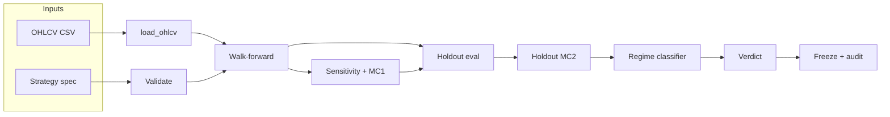

# Topstep Pipeline

A backtesting and evaluation pipeline for MNQ futures strategies against Topstep Combine rules. Runs walk-forward optimization, sensitivity analysis, Monte Carlo simulation, regime classification, and final verdict scoring — all from a single CLI command.

---

## Quick Start

```bash
pip install -e .
python -m v3.cli --list-strategies
python -m v3.cli --strategy hl2_sma_retrace_atr --timeframe 5min
```

Console entry point (after install): `topstep-pipeline` (same flags as `python -m v3.cli`).

**Windows shortcut** (sets PYTHONPATH automatically):
```cmd
run-cli.cmd --strategy hl2_sma_retrace_atr --mode full --timeframe 5min
```

**Force PYTHONPATH if another v3 install shadows this one:**
```powershell
# PowerShell
$env:PYTHONPATH = "$(Resolve-Path .\src)"
python -m v3.cli --strategy hl2_sma_retrace_atr --mode full --timeframe 5min
```
```bash
# macOS / Linux
PYTHONPATH=./src python -m v3.cli --strategy hl2_sma_retrace_atr --mode full --timeframe 5min
```

---

## Requirements

- Python 3.10+
- `pandas >= 2.0`, `numpy >= 1.25`, `scipy >= 1.11`, `matplotlib >= 3.7`

Install:
```bash
pip install -e .
```

---

## Data Setup

Place MNQ OHLCV CSVs in `Data/` (project root). Expected naming convention:

```
Data/MNQ_5min.csv
Data/MNQ_1min.csv
Data/MNQ_15min.csv
```

Override via environment variable:

| Variable | Purpose |
|---|---|
| `TOPSTEP_PIPELINE_DATA_DIR` | Directory containing MNQ CSV bundles (default: `<repo>/Data`) |
| `TOPSTEP_PIPELINE_OUTPUT_DIR` | Result JSON / artifacts (default: `<repo>/output`) |

Or at runtime: `--data-dir /path/to/data`

---

## Pipeline Stages



1. **Validate** — structural validation of strategy spec
2. **Walk-forward** — 2 expanding train/test folds; grid search per fold; robust param selection; per-fold sequential Topstep eval (min 40% seq pass rate per fold by default)
3. **Sensitivity + MC1** — `full` mode only; sweeps each param on the WF dev window via day-group bootstrap, detects cliffs (>25pp drop from default), saves gradient heatmap PNG; runs MC1 (block bootstrap N=1000 on WF dev trades)
4. **Holdout** — evaluates final params on held-out data (Sep 2024 → Mar 2026); includes Express funded reset simulation
5. **Monte Carlo MC2** — block-bootstrap (block_size=5, N=1000) on holdout trades; equity path graph saved to `output/graphs/`
6. **Regime classifier** — calm/volatile bar labeling via rolling log-return stdev; maps holdout trades to regime; emits `prefers_calm` / `prefers_volatile` / `mixed` / `insufficient_data`
7. **Verdict** — REJECT / PROMISING / COMBINE-READY based on configurable thresholds
8. **Freeze + audit** — if not REJECT: write frozen param JSON + SHA-256 hash; append `audit_log.jsonl`

---

## Modes

| Mode | Sensitivity (Stage 3) | Walk-forward |
|---|---|---|
| `quick` (default) | Skipped | Runs |
| `full` | Runs | Runs |
| `holdout-only` | Skipped | Skipped — uses `default_params` |

```bash
topstep-pipeline --strategy hl2_sma_retrace_atr --mode full
topstep-pipeline --strategy hl2_sma_retrace_atr --mode holdout-only
```

---

## Built-in Strategies

| Key | Description |
|---|---|
| `connors_rsi2` | Connors RSI-2 mean reversion |
| `ttm_squeeze` | TTM Squeeze momentum |
| `orb_ib` | Opening range breakout (initial balance) |
| `orb_volatility_filtered` | ORB with ATR volatility filter |
| `orb_wick_rejection` | ORB with wick rejection confirmation |
| `session_pivot_rejection` | Session pivot fade |
| `session_pivot_break` | Session pivot breakout |
| `hl2_sma_retrace_atr` | HL2 SMA retrace with ATR stops (user strategy) |

---

## Key CLI Flags

| Flag | Default | Description |
|---|---|---|
| `--strategy` | required | Strategy key |
| `--mode` | `quick` | `quick`, `full`, or `holdout-only` |
| `--timeframe` | `5min` | Bar timeframe (matches CSV filename) |
| `--eval-risk` | `500` | Dollars risked per trade before contract cap |
| `--max-contracts` | `50` | Max contracts per signal |
| `--min-wf-passes` | `2` | Min folds meeting sequential eval threshold (M-of-F) |
| `--min-eval-passes-per-fold` | `2` | Min sequential Combine passes per qualifying fold |
| `--min-fold-seq-pass-rate-pct` | `40.0` | Min sequential pass rate % per OOS fold |
| `--holdout-mc-iterations` | `1000` | Block-bootstrap permutations for holdout MC2 |
| `--mc-block-size` | `5` | Block size for block-bootstrap MC |
| `--pipeline-config` | built-in | JSON file overriding WF and holdout date windows |
| `--skip-wf` | off | Skip walk-forward; use `default_params` directly |
| `--force` | off | Continue past WF gate failures (verdict may still REJECT) |
| `--optimize-sizing-for-speed` | off | Find risk sizing for fastest Combine pass (see Sizing Optimizers section) |
| `--optimize-sizing-for-longevity` | off | Find risk sizing for max funded account longevity (see Sizing Optimizers section) |
| `--compare-fixed-risk` | unset | Compare optimizer vs a fixed $/trade |
| `--compare-fixed-contracts` | unset | Compare optimizer vs a fixed contract count |
| `--output-dir` | `output/` | Root for JSON, summaries, frozen params |
| `--data-dir` | `Data/` | Directory containing MNQ CSV bundles |
| `--topstep-weight` | `1.0` | Walk-forward scoring weight for topstep_score |
| `--avg-r-weight` | `25.0` | Walk-forward scoring weight for avg_r |

**Verdict threshold flags** (all overridable):
`--reject-pass-rate`, `--reject-max-dd`, `--reject-daily-hit-pct`, `--reject-mean-dd`,
`--ready-pass-rate`, `--ready-max-dd`, `--ready-daily-hit-pct`, `--ready-mean-dd`

---

## Contract / Sizing Optimizers

Two post-evaluation stages in `position_sizing.py`. Both grid-search over risk levels (default `$50` to `$950` in `$50` increments), resize all trades at each level, and rank candidates on a robust objective. Coverage filtering still rejects risk levels that cannot produce enough trades with at least one contract. Results saved to JSON in `output/`.

### Speed Optimizer (`--optimize-sizing-for-speed`)

**Goal:** find the risk-per-trade that gets you through the Topstep Combine fastest with a high pass rate. Soft target is **≤ 10 days to pass**.

**Method (V2 — train-fit, OOS-evaluate, aggregate, adaptive floor):**
1. For each WF fold, optimize on the **training** trades only (no OOS peeking).
2. Cap each evaluation chain at `--speed-attempt-budget` (default 10) — pass rate is `passes / min(N, attempts)`, comparable across risk levels.
3. Filter risks via coverage threshold: each risk must produce ≥ 1 contract on ≥ `--risk-coverage-threshold` (default 50%) of trades.
4. Compute median, mean, IQR, p90, std (ddof=1) of `days_to_pass`.
5. **Adaptive pass-rate floor:** `--pass-floor-pct` now acts as a CEILING. Per fold, compute `effective_floor = min(user_floor, max(20.0, best_train_pass_rate × 0.7))`. If best train pass rate is low (e.g. 35%), floor relaxes to 24.5% so candidates aren't all rejected. Hard minimum of 20% prevents runaway. Reported in output as `effective_pass_floor_pct` and `adaptive_floor_applied`.
6. Rank candidates by **utility = pass_rate × exp(-max(0, median_days − target) / 5)** with target = `--speed-target-days` (default 10). Soft penalty past 10 days.
7. Evaluate the train-winner on the OOS fold to record honest test performance.
8. Aggregate across folds: in the default two-fold setup, keep only risks viable in both folds (explicit `min_viable_folds` overrides still apply); rank by **median OOS utility**, tiebreak by **worst-fold utility**.

**Output:** `output/json/<strategy>_wf_speed_optimization_aggregate.json` (the deliverable). Aggregate `effective_pass_floor_pct` is the median of per-fold effective floors; `adaptive_floor_applied` is True if any fold triggered the relaxation.

| Flag | Default | Description |
|---|---|---|
| `--optimize-sizing-for-speed` | off | Enable speed optimizer |
| `--speed-attempt-budget` | `10` | Max sequential eval attempts per fold/risk |
| `--speed-target-days` | `10.0` | Soft ceiling for days-to-pass; utility decays past this |
| `--pass-floor-pct` | `40.0` | Pass rate ceiling — adaptive floor relaxes if train pass rates are low (min 20%) |
| `--risk-coverage-threshold` | `0.5` | Min fraction of trades that must produce ≥ 1 contract |

### Longevity Optimizer (`--optimize-sizing-for-longevity`)

**Goal:** find the risk-per-trade that keeps a funded account alive longest with low drawdown across holdout — typically smaller size, higher win rate, less DD.

**Method (V2 — block-bootstrap MC + multi-component score):**
1. For each risk level, resize trades and check a **profit-factor floor** (`--longevity-min-profit-factor`, default 1.2).
2. Run **bootstrap CI on avg PnL/trade** (`--longevity-bootstrap-iterations`, default 1000). The percentile floor (`--longevity-confidence-level`, default p05) must clear `--min-profit-per-trade`. This rejects risks that only look profitable due to small-sample luck.
3. Run **block-bootstrap Monte Carlo** over the resized holdout trades (`--longevity-mc-iterations` runs, `--longevity-mc-block-size` block size — defaults 500 / 5). Each MC iteration runs `simulate_express_funded_resets` and computes:
   - `survival_score = (accounts_used − accounts_blown) / accounts_used` ∈ [0, 1]
   - `drawdown_score = 1 − (worst_peak_to_trough / max_drawdown_limit)` ∈ [0, 1]
   - `efficiency_score = avg_pnl_per_trade / target_pnl_per_trade`
   - `capital_score = total_pnl / account_size`
4. Composite **`longevity_score = w_survival·survival + w_drawdown·drawdown + w_efficiency·efficiency + w_capital·capital`** (defaults 0.4 / 0.2 / 0.2 / 0.2 — all overridable).
5. **Hard survival filter:** `p05(survival_score) ≥ 0.5` — catastrophic-failure risks rejected regardless of score.
6. Rank survivors by `median(longevity_score)`, tiebreak by `p05(longevity_score)`.
7. Per-account survival days from the deterministic baseline sim are surfaced for the chosen risk.

**Output:** `output/<strategy>_holdout_longevity_optimization_mc.json`

| Flag | Default | Description |
|---|---|---|
| `--optimize-sizing-for-longevity` | off | Enable longevity optimizer |
| `--longevity-mc-iterations` | `500` | Block-bootstrap MC permutations over holdout |
| `--longevity-mc-block-size` | `5` | Trade block size for the bootstrap |
| `--longevity-bootstrap-iterations` | `1000` | Resamples for the avg-PnL CI floor |
| `--longevity-confidence-level` | `0.05` | Percentile (e.g. 0.05 = p05) for confidence floors |
| `--longevity-weight-survival` | `0.4` | Weight on survival component |
| `--longevity-weight-drawdown` | `0.2` | Weight on drawdown component |
| `--longevity-weight-efficiency` | `0.2` | Weight on per-trade efficiency component |
| `--longevity-weight-capital` | `0.2` | Weight on total-PnL component |
| `--longevity-min-profit-factor` | `1.2` | Reject risks with profit factor below this |
| `--min-profit-per-trade` | `150.0` | Floor on p05 of bootstrap mean PnL per trade |

### Sizing Comparison (Optimizer vs. Fixed)

Test the optimizer against a fixed sizing of your choice. Pipeline runs up to 3 tracks through eval **and** holdout, then reports deltas with sanity flags.

| Flag | Default | Description |
|---|---|---|
| `--compare-fixed-risk` | unset | Fixed $/trade for comparison track (e.g. `100`) |
| `--compare-fixed-contracts` | unset | Fixed contract count for comparison track (e.g. `2`) |

When either is set, the comparison runs and writes `output/<strategy>_sizing_comparison.json`. Both can be set simultaneously for a 3-track race (Optimizer / Fixed-$ / Fixed-contracts).

**Sanity flags** are raised when:
- A fixed track beats the optimizer's eval pass rate by > 5pp
- A fixed track beats the optimizer's holdout longevity score by > 0.10
- The optimizer chose a risk viable in fewer than all WF folds
- Holdout sample size < 50 trades

The comparison **just reports** — it does not auto-recommend. Read the sanity flags before freezing.

### Example — run optimizers + comparison

```bash
topstep-pipeline --strategy hl2_sma_retrace_atr --mode full \
  --optimize-sizing-for-speed --speed-target-days 10 \
  --optimize-sizing-for-longevity --min-profit-per-trade 150 \
  --compare-fixed-risk 100 --compare-fixed-contracts 2
```

The text summary (`output/txt summaries/<strategy>_<tf>_result_summary.txt`) puts the chosen `EVAL SIZING` and `FUNDED SIZING` values in a bordered "FROZEN PARAMETERS" block at the top, with `>>>` markers and explicit annotations of which metric each risk parameter optimizes.

## Default Date Windows

| Window | Start | End |
|---|---|---|
| WF1 train | 2021-03-19 | 2023-02-28 |
| WF1 test | 2023-03-01 | 2023-11-30 |
| WF2 train | 2021-03-19 | 2023-11-30 |
| WF2 test | 2023-12-01 | 2024-08-31 |
| Holdout | 2024-09-01 | 2026-03-18 |

Override with `--pipeline-config config/your_windows.json`. See `config/README.md` for JSON schema.

---

## Verdict Logic

**REJECT** if any of:
- Combine pass rate < 50%
- Max drawdown > $1,800
- Daily loss limit hit rate > 60%
- Average max drawdown > $1,200

**COMBINE-READY** if all of:
- Combine pass rate ≥ 75%
- Max drawdown ≤ $1,400
- Daily loss limit hit rate ≤ 25%
- Average max drawdown ≤ $800

Otherwise: **PROMISING**

All thresholds are overridable via `--reject-*` / `--ready-*` CLI flags.

---

## Output Layout

```
output/
  json/            <strategy>_<timeframe>_result.json              — full result bundle
                   <strategy>_wf_speed_optimization_aggregate.json — speed optimizer output
                   <strategy>_holdout_longevity_optimization_mc.json — longevity optimizer output
                   <strategy>_sizing_comparison.json               — sizing comparison output
  txt summaries/   <strategy>_<timeframe>_result_summary.txt       — human-readable pipeline report
  graphs/          MC path plots, sensitivity heatmaps (.png)
  frozen_params/   SHA-256 hashed param files + audit_log.jsonl
```

**Re-run behavior:** files are named by `<strategy>_<timeframe>` and overwrite on re-run with same args. To preserve runs, pass a unique `--output-dir`.

---

## Instrument Defaults (MNQ)

| Setting | Value |
|---|---|
| Point value | $2.00 |
| Tick size | $0.25 |
| Commission | $1.40 round-turn |
| Slippage | 0.25 points per side |

---

## TopStep 50K Combine Rules (hardcoded defaults)

| Rule | Value |
|---|---|
| Account size | $50,000 |
| Profit target | $3,000 |
| Max drawdown | $2,000 |
| Daily loss limit | $1,000 |
| Min trading days | 5 |
| Max micro contracts | 50 |
| Consistency rule | 50% of profit target max per day |

---

## Adding a Custom Strategy

1. Create `src/v3/user_strategies/your_strategy.py`
2. Define a `generate` function: `(df: pd.DataFrame, params: dict) -> list[TradeSignal]`
3. Build a `StrategySpec` and call `register_strategy(spec)` at module load
4. The pipeline auto-discovers all files in `user_strategies/` on startup

See `src/v3/user_strategies/hl2_sma_retrace_atr.py` as a reference.

---

## Running Tests

```bash
pytest
# or just the v3 suite
python -m pytest tests/v3/ -q
```

---

## Repository Layout

| Path | Role |
|---|---|
| `src/v3/` | Package `v3`: backtest engine, Topstep rules, pipeline CLI |
| `src/v3/user_strategies/` | Drop-in user strategy files (auto-loaded) |
| `tests/` | Pytest suite |
| `config/` | Optional JSON date windows (`--pipeline-config`) |
| `scripts/` | Standalone utilities (e.g. result JSON summarizer) |
| `run-cli.cmd` | Windows launcher (sets PYTHONPATH to this repo's src/) |
| `pyproject.toml` | Build config and dependencies |

`Data/`, `output/`, and `frozen_params/` are excluded from git. Do not force-add local run artifacts.

---

## `src/v3/` Module Reference

| File | Responsibility |
|---|---|
| `cli.py` | Entry point — arg parsing and full 8-stage orchestration |
| `config.py` | Paths, session times, `WINDOWS`, `TopStepRules`, MNQ constants, scoring weights, verdict thresholds |
| `pipeline_config.py` | Load optional JSON date windows |
| `data.py` | OHLCV CSV loader with session filtering |
| `trades.py` | `TradeResult` dataclass |
| `strategies.py` | `StrategySpec` registry + all built-in strategies |
| `indicators.py` | ATR, RSI, linreg, and other bar-level helpers |
| `pivots.py` | Session pivot point calculations |
| `validator.py` | Strategy spec validation and filter reference checks |
| `evaluator.py` | Trade simulation, metrics, walk-forward runner, sequential OOS stats |
| `topstep.py` | Combine simulation + sequential eval pass counting |
| `funded_express_sim.py` | Multi-stint Express funded reset simulation on holdout trades |
| `combine_simulator.py` | Day-group bootstrap → Combine pass rate (used by sensitivity) |
| `sensitivity.py` | Param sweep, cliff detection, gradient heatmap |
| `monte_carlo.py` | Block-bootstrap MC engine (shared by MC1 and MC2) |
| `holdout_monte_carlo.py` | MC2 wrapper for holdout trades |
| `regime_classifier.py` | Calm/volatile bar labeling + per-regime trade stats |
| `position_sizing.py` | Speed (fastest Combine pass) and longevity sizing optimizers |
| `verdict.py` | Pipeline and Combine-sim verdict helpers |
| `freeze.py` | Frozen parameter snapshots + SHA-256 verification |
| `audit_stamp.py` | Audit JSON + JSONL append log |
| `json_readable.py` | Result JSON → human-readable text export |
| `user_strategies/hl2_sma_retrace_atr.py` | HL2 SMA retrace + ATR stop/target user strategy |
